 

# Dental Clinic

Project focused in create a karting Website with React  implementing all kinds of functionalities

I leave here the administrator user to have access to everything

admin@gmail.com

password:admin123

# Functionality

First of all here whe have the main page, the one that you see as normal person searching in google

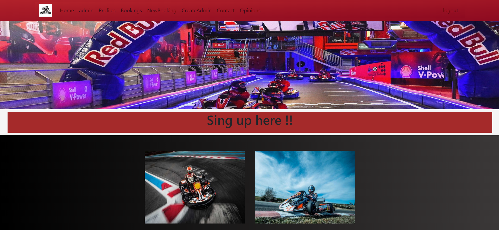

If you are not registered yet you must do to get access

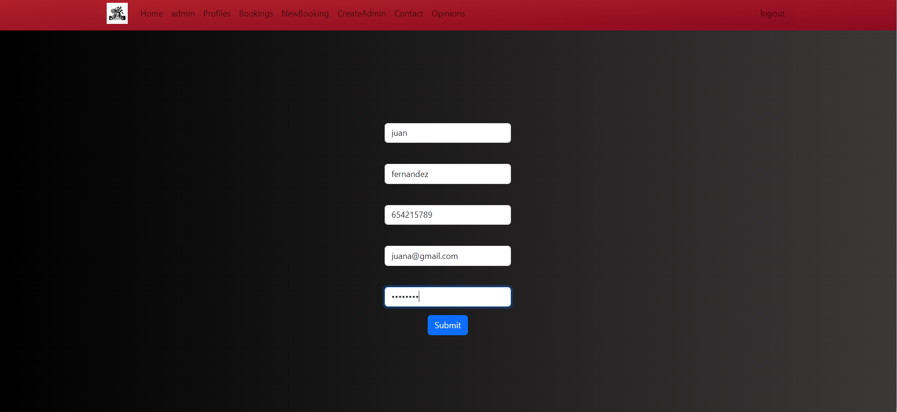

Rigth after get registered the website take you to the login page.

 it´s time to log in to have a look into tha website

 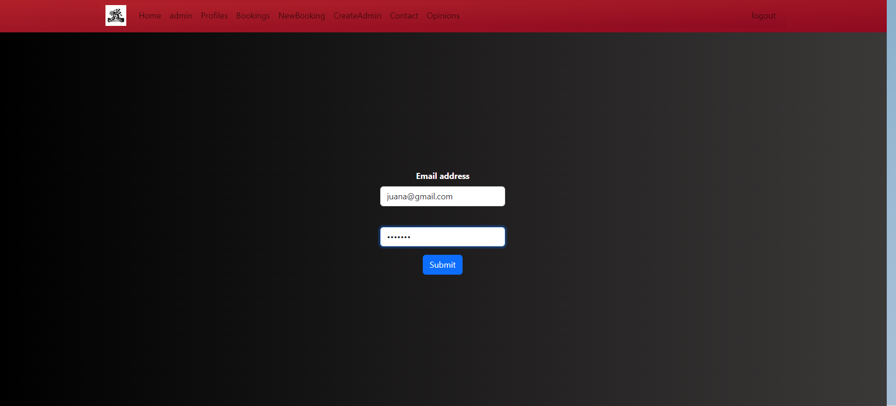

 Once we are into the website we can check our profile information

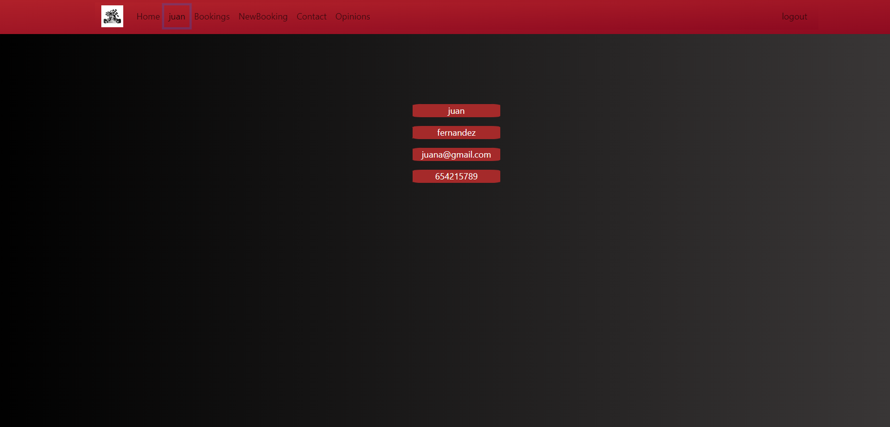

 And also we can interactuate with the website, let´s create a Booking

 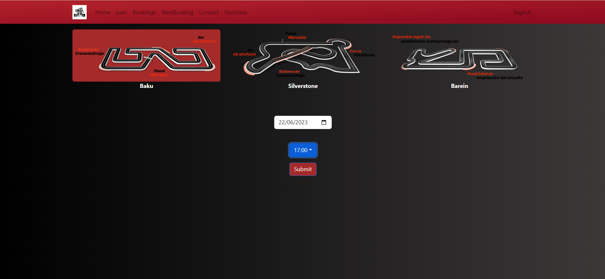

 Once that we have created an appointment let´s see our appointment

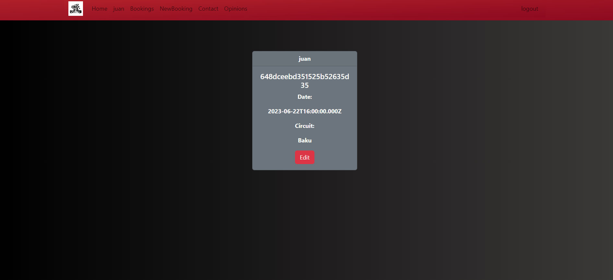

 if you make any mistake doing this you can modify the appointment
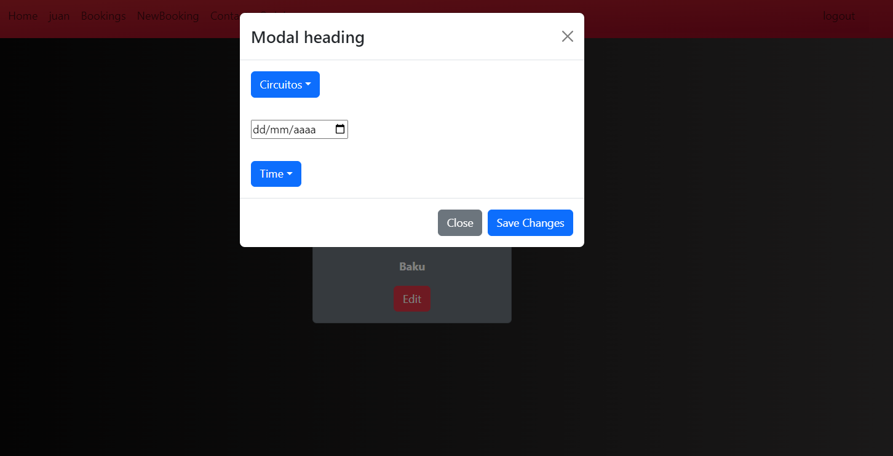

it´s time to make a review we had fun let´s share ours impressions

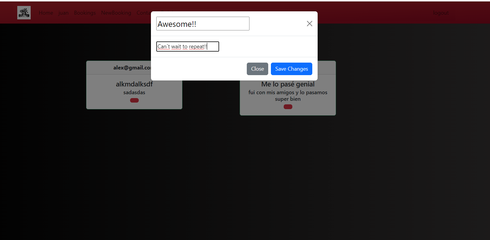

As a admin you can do a few things else

 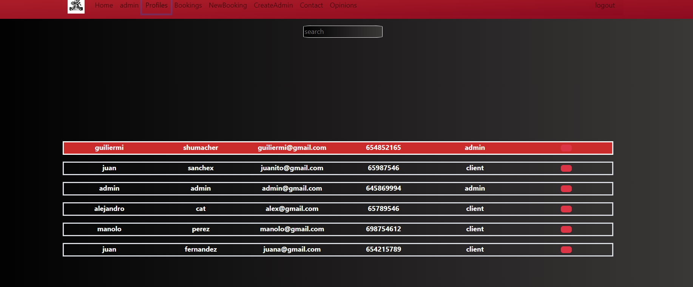

 you can visualize all the profiles and delete them if you want

 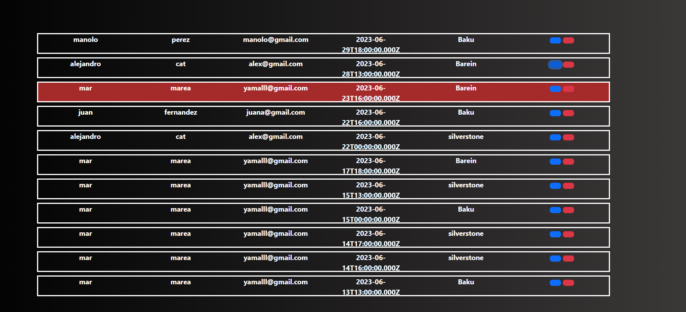

 you also can modify/delete the bookings from anyone,and create users with admin role.

 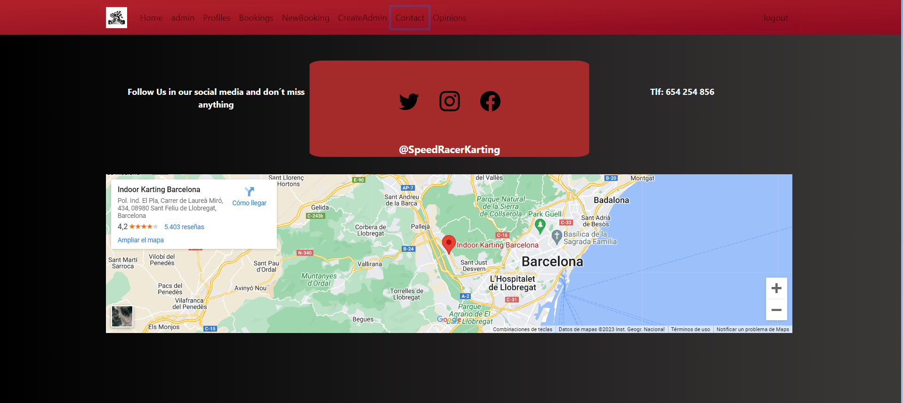

 finally the contact page where you can se our location and our social medoa

 

# Technologies used

  
  
  

# Inquires 

If you got any inquires get in touch by Linkedn with any of us:

<a href="https://www.linkedin.com/in/carlos-sabrido-medina-624b77258/"> Carlos Sabrido Medina linkedin </a>
